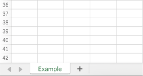
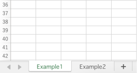
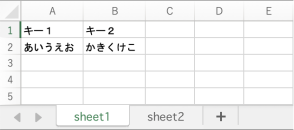

# sheetタグ

sheetタグはExcelのシートを表すタグです。

## 子要素

sheetタグは以下のタグを子要素として持つことができます。

- row
- column
- cell
- vertical-for
- horizontal-for

## プロパティ

| プロパティ名 | 役割 |
| --- | --- |
| name | シート名を設定します。item、collectionタグを使用している場合は無視されます。 |
| item | collectionを使用する場合に指定します。子孫要素はこのプロパティで指定した変数でcollectionの要素にアクセスすることができます。 |
| collection | データコレクションです。データ件数の数だけsheetが自動的に作成されます。 |
| autoSizeColumn | 列幅の自動調整を行うかどうかを設定します。`true` を指定すると有効、`false` を指定すると無効になります。未指定時は新規ブック作成では有効、テンプレートへの書き込みでは無効です。 |

## シートの出力

```xml
<?xml version="1.0" encoding="utf-8"?>
<forma>
  <sheet name="Example">
  </sheet>
</forma>
```



## 複数シートの出力

```xml
<?xml version="1.0" encoding="utf-8"?>
<forma>
  <sheet name="Example1">
  </sheet>
  <sheet name="Example2">
  </sheet>
</forma>
```



## 列幅の自動調整

sheetタグの `autoSizeColumn` プロパティで列幅の自動調整を制御できます。

```xml
<?xml version="1.0" encoding="utf-8"?>
<forma>
  <sheet name="Example" autoSizeColumn="false">
    <cell rowIndex="0" columnIndex="0">abcdefghijklmnopqrstuvwxyz0123456789</cell>
  </sheet>
</forma>
```

`autoSizeColumn` を省略した場合の既定値は以下の通りです。

- 新規ブック作成時: `true`
- テンプレートへの書き込み時: `false`

## 書き込み定義が同一のシートを複数出力

collectionプロパティを利用することで書き込み定義が同一のシートを複数出力させることができます。collectionに複数シート分のデータをセットすることで複数シート出力することができます。

```xml
<?xml version="1.0" encoding="utf-8"?>
<forma>
  <sheet item="data" collection="list">
    <cell rowIndex="0" columnIndex="0">#{data.key1}</cell>
    <cell rowIndex="0" columnIndex="1">#{data.key2}</cell>
    <cell rowIndex="1" columnIndex="0">#{data.key3}</cell>
    <cell rowIndex="1" columnIndex="1">#{data.key4}</cell>
  </sheet>
</forma>
```

Forma4jには以下のような形式のJSONを読み込ませてください。`sheetName` というキーが自動的にシート名として扱われます。

```json
{
  "list": [
    {
      "sheetName": "sheet1",
      "key1": "あいうえお",
      "key2": "かきくけこ",
      "key3": "さしすせそ",
      "key4": "たちつてと"
    },
    {
      "sheetName": "sheet2",
      "key1": "なにぬねの",
      "key2": "はひふへほ",
      "key3": "まみむめも",
      "key4": "やゆよ"
    }
  ]
}
```


